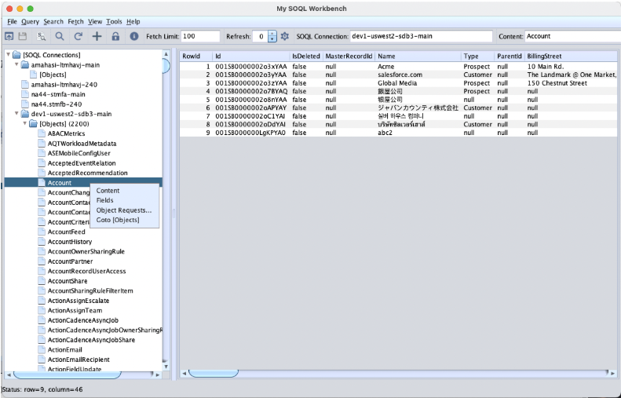

# MySOQL2 v1.2 MVP — Salesforce SOQL Desktop Query Tool



**MySOQL2** (My Salesforce Object Query Language) is a desktop application written in Java Swing that connects to Salesforce via HTTP APIs. It allows users to configure and persist connections to multiple Salesforce orgs. Serving as a GUI front end for SOQL, it empowers users to build SOQL queries either by entering them manually or using the built-in UI to generate statements, providing functionality similar to Salesforce Workbench.

**MVP (Minimum Viable Product) edition** — subset of features for essential SOQL work.

For more details on creating a Connected App in Salesforce for OAuth, refer to: https://help.salesforce.com/s/articleView?id=platform.ev_relay_create_connected_app.htm&type=5

## What's in this package

| File | Description |
|------|-------------|
| `mysoql.jar` | Application JAR |
| `mysoql2.sh` | Linux/Mac launcher |
| `mysoql2.bat` | Windows launcher |
| `mysoql.xml` | Application config |
| `mysoql.ini` | JAVA_HOME config |
| `log4j2.xml` | Logging config |
| `misc/` | Runtime dependency jars (Tika, Log4j, Gson, Guava) |

## Requirements

- JDK 17+
- A Salesforce org with OAuth2 connected app credentials

## Quick start

```bash
# Linux/macOS
./mysoql2.sh

# Windows
.\mysoql2.bat
```

If `java` is not on your PATH, set `JAVA_HOME` in `mysoql.ini`.

## MVP Features

This MVP build includes:
- OAuth2 authentication to Salesforce orgs
- SOQL query editor with multi-statement support
- Paginated query results
- Export to XML, CSV, HTML
- Connection browser with org metadata navigation
- Basic CRUD (Insert/Update/Delete) on query results

## Disabled features (MVP)

The following features are disabled in this MVP edition:
- Certificates management
- Detect Encoding (files)
- HTTP Request (REST API)
- Import/Upload/Fetch Content
- Detect Content / Translate Content
- Batch Delete

For full feature access, use the standard [MySOQL2-mvn-releases](https://github.com/amahasintunan/MySOQL2-mvn-releases) edition.
